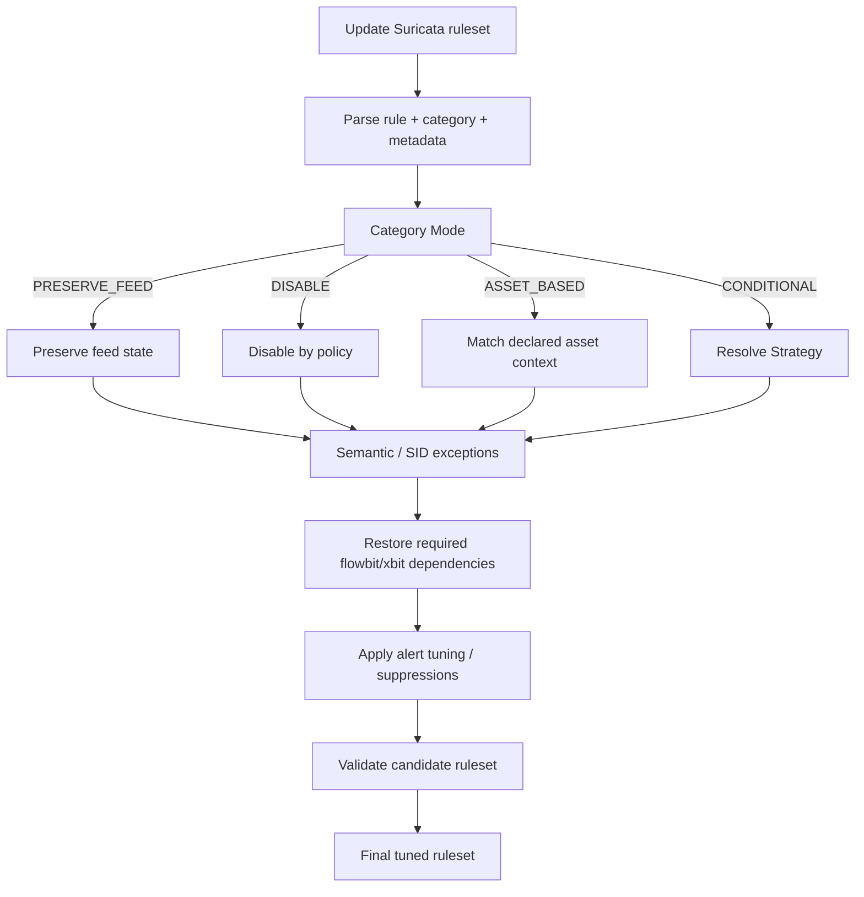
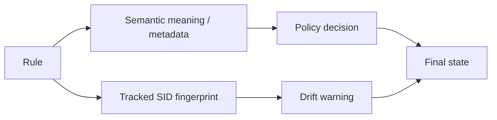
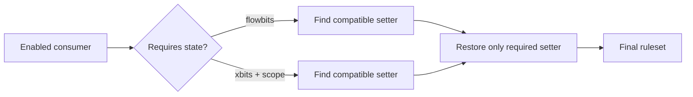
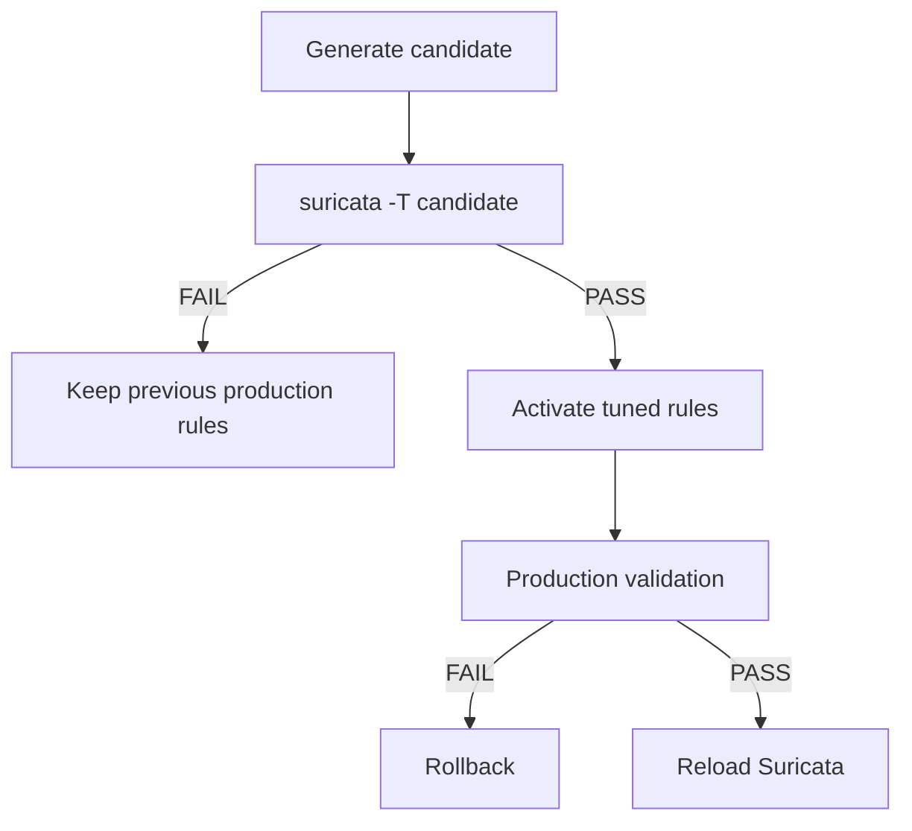

# How Suricata Policy Engine Works

## Decision pipeline



## Mode vs Strategy

Think of Mode as the first question:

> **What kind of decision does this category need?**

If Mode is `PRESERVE_FEED`, `DISABLE` or `ASSET_BASED`, that first-stage choice is enough. If Mode is `CONDITIONAL`, the engine asks a second question:

> **Which Strategy should resolve the condition?**

Example:

```text
ET_REMOTE_ACCESS
  Mode     = CONDITIONAL
  Strategy = organization_policy
```

The category is not simply on or off. The second-stage strategy reads the organization's remote-access usage/detection policy.

## SID logic

The engine does not depend on a fixed SID allowlist as its primary policy.



Semantic selectors keep important detection ideas resilient to SID replacement. Tracked SIDs provide audit warnings if a known rule disappears or changes.

## Dependency logic



The engine restores setters only when a rule that remains enabled actually depends on them. `flowbits:isset,a|b` is treated as an OR dependency. Xbit matching includes scope and direction rather than comparing only the bit name.

## Safe activation



The recommended activation path keeps the original feed file intact and points `rule-files` at `suricata-tuned.rules`, validates production configuration, and then performs a blocking ruleset reload or controlled service restart. The TUI reports **LIVE SWITCH COMPLETED** only when the running engine is actually controlled successfully.

Before modifying production configuration, the engine inspects the running Suricata command line. A conflicting `-S/--sig-file` or a different `-c/--config` causes activation to stop because changing the requested YAML would not switch that live process. If no running Suricata exists, the configuration is reported as **STAGED** and the user is told that a start/restart is still required.

Replacing the original `suricata.rules` remains available only as an explicit **Not Recommended** path with backup and rollback.

## Profile to Custom policy

```text
Balanced (preset)
       |
       v
Effective Policy
   ^          ^
   |          |
Standard   Advanced
 edits      edits
```

Profiles initialize the same YAML policy edited by Standard and Advanced Settings. Any manual edit makes the policy `Custom (based on <profile>)`.
